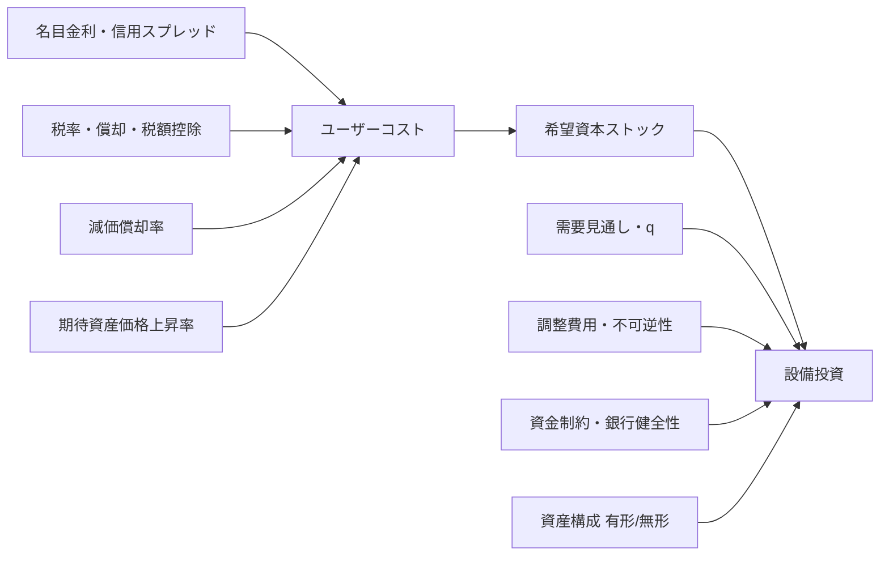

# ホール＝ジョルゲンソン型の資本コストと日本への含意

本レポートでは、未指定の対象期間・産業は「特に制約なし」として扱い、原資料側で推定期間や数値が明示されていない場合は「未指定」と記しました。整理の軸は、理論的基礎、実証的エビデンス、コンセンサスと主要論点、日本固有の要因、改善と実務的示唆、今後の研究課題と実装上のリスクです。

## エグゼクティブサマリ

- ホール＝ジョルゲンソン型の資本コストは、現在でも**限界投資の採算条件**と**資本サービス価格の測定**の双方で中心的な枠組みです。もっとも、現在のコンセンサスは「弾力性は常に -1」という単純なものではありません。Jorgenson 型の**産出量固定**の弾力性、Coen 型の**売上・需要のフィードバックを含む**弾力性、短期の**投資率の半弾力性**、一般均衡の弾力性が混同されやすく、そこが現代の主要論点です。 citeturn14view0turn20view0turn42search9

- 国際実証の読み方としては、投資のユーザーコスト感応度は「ある／ない」ではなく、**何を固定し、何を被説明変数にし、どの期間で測るか**で大きく変わる、というのが現時点の実質的なコンセンサスです。近年の整理では、短期の \(I/K\) 比率のユーザーコスト半弾力性はおおむね **-0.25 から -0.75** に収まり、そのまま長期の資本ストック弾力性や一般均衡効果に読み替えるのは不適切だとされています。さらに、資本・労働の代替弾力性は、出版バイアス等を補正すると**平均 0.3 程度**まで下がるというメタ分析もあり、政策評価で機械的に 1 を置く実務には再検討の余地があります。 citeturn20view0turn42search12turn17search19

- 日本については、ホール＝ジョルゲンソン型はすでに**統計実務の中核**に入っています。内閣府 ESRI の JSNA 参考系列は、所有主体別の内部収益率と資本サービス価格を用いて 1994 年以降の資本サービス系列を公表しており、JIP Database 2023 も 100 産業について資本コストと資本サービス投入指数を整備しています。他方、企業の設備投資行動については、日本銀行の 2025 年研究が、**無形資産比率の高い企業ほど金利感応度が低い**こと、成長期待の低下や人手不足が感応度をさらに押し下げうることを示しています。 citeturn31view1turn30view1turn30view0turn32view0turn28view0turn29view3

- 日本固有の論点として重要なのは、**長期のゼロ近傍金利・デフレ/低インフレ環境、債務優遇を含む税制、無形資産比率の上昇、銀行依存の高い資金調達、中長期需要期待の弱さ、そして会計基準の違い**です。とくに日本基準では研究開発費は原則として発生時費用処理である一方、IFRS では一定の要件を満たす開発費は無形資産計上されるため、無形資産資本の測定可能性と比較可能性に制度差が残ります。2026 年 4 月末時点で、東証上場企業のうち IFRS 適用済・適用決定会社は 313 社です。 citeturn28view0turn21search10turn3search10turn37search1turn38search1turn35search1

- 改善の方向性としては、**単一の WACC をHall-Jorgenson型 user cost の代用にしないこと**、有形・無形・建設資産・海外資本を分けた**資産別・事前的**ユーザーコストを構築すること、税制評価では**user cost と EMTR を併記**すること、建設物価や無形資産の**デフレーター整備**を進めること、そして東証の「資本コストや株価を意識した経営」と統計的な資本コスト概念を橋渡しする説明責任を高めることが有効です。日本の税制シミュレーションでは、ACE/ACC 型改革が日本の資本コスト・限界実効税率を引き下げる方向で作用し、CBIT は資金調達中立性を高める一方で投資インセンティブを弱めうることが示されています。 citeturn26view0turn25view0turn7search8turn3search7turn3search11

## 理論的基礎

**事実。** ホール＝ジョルゲンソン型の原点は、Jorgenson の 1963 年論文と Hall and Jorgenson の 1967 年論文にあります。Jorgenson は企業価値最大化から資本需要を導き、Cobb-Douglas 型の下で希望資本ストックを \(K^*=\alpha Y/R\) と表しました。ここで \(Y\) は売上・産出、\(R\) は資本のユーザーコストです。Hall and Jorgenson はこれを税制分析へ拡張し、法人税率、償却控除、利子控除、投資税額控除などを資本コストの中に織り込み、税制変更が投資にどう波及するかを示しました。 citeturn14view0turn20view0turn15search1

**事実。** 原型モデルの重要な前提は、長期均衡では資本の限界生産力が資本のレンタル価格に一致することです。Jorgenson の簡約形では、資本利得を「一時的」とみなすと、ユーザーコストは税率 \(u\)、償却控除 \(v\)、利子控除 \(w\)、名目利子率 \(r\)、償却率 \(\delta\)、資本財価格 \(q\) の関数として表されます。原論文は同時に、価格や利子率を与件とし、投資プロジェクトの完成ラグ分布を固定し、置換投資を資本ストックに比例させるという、かなり強い仮定を置いています。 citeturn14view0turn43view0

\[
K^*=\alpha \frac{Y}{R}
\]

\[
c
=
q\left[
\frac{1-uv}{1-u}\delta
+
\frac{1-uw}{1-u}r
\right]
\]

**事実。** 現代の統計実務では、上式はより一般化され、**期待資産価格変化**と**事前・事後の収益率**を含む形で使われます。OECD の資本測定マニュアルは、資本サービス価格を「資本の使用者コスト」として整理し、名目率・実質率の双方で提示しています。日本の JSNA 参考系列も、所有主体別の内部収益率 \(r_{j,t}\)、償却率 \(\delta\)、平均取得価格、期待キャピタルゲイン \(\pi^e\) を組み込んだ形で資本サービス価格を計算しています。Diewert and Lawrence も、ex ante と ex post の測定の差は capital gains の扱いと期待形成に大きく依存すると整理しています。 citeturn8search0turn31view1turn8search11

\[
p_{i,j,t}^{K}
=
\left(
r_{j,t}
+
\delta_{i,j,t}\frac{\bar p_{i,j,t}^{A}}{p_{i,j,t-1}^{A}}
-
\pi_{i,j,t}^{e}
\right)
p_{i,j,t-1}^{A}
\]

**解釈。** 実務上もっとも重要なのは、ホール＝ジョルゲンソン型の「資本コスト」を、企業財務でいう単一の WACC や、東証文脈での「資本コスト」一般と混同しないことです。WACC は主として資金調達側の要求収益率ですが、Hall-Jorgenson 型 user cost は**資産別・税引後・減耗込み・期待価格変動込み**の限界使用コストです。したがって、両者は関連するものの同一ではなく、WACC をそのまま user cost に代入すると、とくに無形資産、建設投資、税額控除、償却制度の違いを落としやすいと解されます。 citeturn20view0turn31view1turn3search7

この概念図のとおり、Hall-Jorgenson 型は「ユーザーコスト→希望資本ストック→投資」という基幹経路を与えますが、実際の投資は需要期待、調整費用、不可逆性、資金制約、資産構成によって大きく修正されます。現代の論争は、むしろこの「修正の仕方」をめぐるものです。 citeturn20view0turn41search17turn28view0

## 実証的エビデンス

**事実。** 実証研究は大きく三つに分かれます。第一は、Hall-Jorgenson/Jorgenson 型の**投資・資本需要方程式**を推定する研究です。第二は、税制変更を利用して**user cost や EMTR の変化**から投資反応を識別する研究です。第三は、OECD・JSNA・JIP のように、資本サービスと生産性分析のために**資本サービス価格系列そのものを構築する研究・統計**です。これらは「推定している対象」が異なるため、単純比較はできません。近年の整理は、この非同質性自体が先行研究の混乱の主要因だったと指摘しています。 citeturn20view0turn8search0turn30view1turn30view0

下表は、**弾力性・資本コスト水準・公的系列**をあえて同じ表に並べたものです。数値の意味は同質ではなく、**何を推定したか**を合わせて読む必要があります。 citeturn20view0turn25view0turn31view1

| 区分 | 研究・資料 | 推定対象 | 主な推定値・含意 | 手法 | データ期間 | 出典 |
|---|---|---|---|---|---|---|
| 国際 | Jorgenson (1963), Hall & Jorgenson (1967) | 条件付き長期資本需要 | Cobb-Douglas 下で \(K^*=\alpha Y/R\)。産出固定の user-cost elasticity は -1 が理論ベンチマーク | ネオクラシカル投資モデル、分布ラグ、税制組込み | 米国四半期集計、1948–1960 を含む | citeturn14view0turn20view0 |
| 国際 | Chirinko, Fazzari & Meyer (1999) | 企業資本形成の user-cost 感応度 | 後続文献で**約 -0.25**の低めの弾力性として広く参照 | 企業ミクロ投資方程式 | 未指定 | citeturn17search1turn17search5 |
| 国際 | Chirinko, Fazzari & Meyer (2004) | 長期パネルでの代替弾力性 | OLS/IV とも**約 0.40**の代替弾力性。1999年研究より高い | long-panel approach | 未指定 | citeturn17search19 |
| 国際 | Wen & Yilmaz (2020) | カナダの長期 UCE | 機械設備の長期 UCE は **-1.312**、METR 半弾力性は**約 -0.2**。非住宅建設は有意差なし | 誤差修正モデル ECM、州×産業×年の税制差利用 | 初期 2000 年代の税制改革を識別に利用 | citeturn18search4 |
| 日本 | Hayashi & Inoue (1991) | q と資本成長の関係 | 日本製造業の資本成長は q と一対一関係で整理可能。サンプル初期では cash flow も有意 | 企業パネルの q モデル | 未指定 | citeturn44search1 |
| 日本 | 永幡・関根 (2002, 日銀) | 金利・資産価格・設備投資 | バブル崩壊後、**金利チャネルは機能**したが、**資産価格下落が信用チャネルを減殺** | 個別企業データの投資関数 | 主にバブル崩壊後 | citeturn6search4 |
| 日本 | ESRI 資本サービス参考系列 | 資本サービス価格・内部収益率 | 所有主体別の内部収益率と資本サービス価格を公表。user cost を公的に系列化 | JSNA に整合的な資本サービス測定 | 1994年以降 | citeturn30view1turn31view1 |
| 日本 | JIP Database 2023 | 産業別資本コスト・資本サービス | 100 産業について capital costs と capital service input indices を収録。R&D・ソフトウェアを資本サービスに反映 | Divisia/Törnqvist 的集計、Jorgenson-Griliches 流 | 1994–2020 | citeturn30view0turn32view0 |
| 日本 | Uemura (2023, 財務省 PRI) | 制度改正時の資本コスト・EMTR | 日本 2020 パラメータの base case で retained earnings/new equity の複合資本コスト **8.03%**、複合 EMTR **37.76%**。単純 ACE/ACC では **4.85%**、**-3.09%** まで低下 | forward-looking ETR model | 2020 パラメータによる制度シミュレーション | citeturn26view0 |
| 日本 | 平田・高橋・加藤 (2025, 日銀) | 近年の設備投資の金利感応度 | **無形資産比率の高い企業ほど感応度が低い**。成長期待低下・人手不足も感応度を押し下げうる | パネル LP-IV、企業活動基本調査等の調査票情報 | データは 2023 年まで | citeturn28view0turn29view3 |

**事実。** 国際文献の重要なポイントは、短期と長期、部分均衡と一般均衡、output fixed と revenue fixed を混同しないことです。Chodorow-Reich は、短期の \(I/K\) 比率の user-cost 半弾力性を **-0.25～-0.75** と整理し、そこから逆算される長期の企業レベル資本弾力性は **-3 以下**にもなりうる一方、一般均衡で労働を固定した資本弾力性は **-0.65～-1.7** の範囲に入ると要約しています。これは、「-1」を万能の政策係数として使うべきではないことを意味します。 citeturn20view0

**事実。** 日本の文献は、純粋な Hall-Jorgenson 式の弾力性推定よりも、q モデル、銀行・資産価格チャネル、そして近年では無形資産と金利感応度の関係に重点が移ってきました。Hayashi and Inoue は q による説明力を示しつつ初期サンプルで cash flow の上乗せ効果を確認し、永幡・関根はバブル崩壊後に金利チャネルと信用チャネルの非対称性を示しました。さらに日銀 2025 年研究は、日本では無形資産投資の増加が設備投資の金利感応度低下に寄与している可能性をかなり強く示しています。 citeturn44search1turn6search4turn28view0turn29view3

**解釈。** したがって、日本の実証エビデンスは「ユーザーコスト無効」ではありません。むしろ、日本では Hall-Jorgenson 型のコア条件は**統計作成では強く生き残り**、企業行動推定では**q、資産価格、信用制約、無形資産**による補正が強く必要、という二層構造で理解するのが妥当です。ここで重要なのは、モデルを捨てることではなく、**何に効く user cost なのかを資産ごとに分けること**です。 citeturn30view1turn30view0turn28view0

## コンセンサスと主要な論点

**事実。** 現在のコンセンサスは、第一に、Hall-Jorgenson 型は税制分析と資本サービス測定の**ワークホース**であり続けていること、第二に、実証上の「一つの user-cost elasticity」は存在しないこと、第三に、設備・建物・在庫・無形資産では反応がかなり異なることです。OECD は EMTR/EATR の標準化比較を毎年更新し、JSNA と JIP は国内統計で asset-specific な user cost を実装しています。他方で、理論・実証の橋渡しでは、「何を固定した弾力性か」が最重要論点として再浮上しています。 citeturn8search0turn23view0turn30view1turn30view0turn20view0

**事実。** 主な批判は四つあります。第一に、**調整費用・内生性・需要ショック**を十分に処理しないと、投資方程式は user cost を過小にも過大にも評価しうることです。第二に、**不可逆性と不確実性**が大きいと、企業は「待つ価値」を持つため、単純な限界条件だけでは投資のタイミングを説明しにくいことです。第三に、**低金利環境では user cost と EMTR の単調関係が崩れる**可能性があり、税制評価と投資評価にズレが生じうることです。第四に、文献全体でみると、**代替弾力性に出版バイアスや手法依存性**があることです。 citeturn18search4turn41search17turn21search10turn42search12

**事実。** 代替モデルとの比較では、q モデルは資本市場評価を通じて期待収益を要約する点で有用であり、実際に日本企業の投資では説明力があります。しかし、q だけでは税制・償却・相対価格・金利・資産別減耗を明示的に分解しにくく、税制改革の評価には Hall-Jorgenson 型がなお優位です。逆に、real options や不確実性モデルは、不可逆投資の**タイミング**には強いが、税制・資本サービス価格の会計的計測にはそのままでは使いにくい、という補完関係があります。 citeturn44search1turn20view0turn41search17turn41search14

**解釈。** 要するに、現在の主流的理解は「Hall-Jorgenson を捨てて別モデルに置き換える」ではありません。より正確には、**Hall-Jorgenson をベースラインの会計・税制モデルとして使い、その上に q、信用制約、不可逆性、無形資産を重ねる**という layered approach が現実的です。政策評価や公的統計ではこの順序がとくに重要で、最初から q や real options だけで始めると、税制の効果分解や資本サービス集計と整合しなくなるためです。 citeturn8search0turn31view1turn20view0

## 日本固有の要因

**事実。** 日本では 1990 年代後半以降の長い期間、名目短期金利がゼロ近傍で推移し、日銀 2025 年論文も 2024 年 3 月の非伝統的金融政策終了を一つのレジーム転換点として位置づけています。Hall-Jorgenson 型では、名目金利の低下は user cost を押し下げますが、同時に期待インフレや相対資本財価格の変化、信用スプレッドの変化が重要です。低金利下では、そもそも user cost と EMTR の関係が単純ではなくなるため、日本のような環境では利子率の低さだけから「資本コストは十分低い」と結論できません。 citeturn28view0turn21search10turn31view1

**事実。** 日本の税制面では、財務省資料によれば 2025 年時点の法人実効税率は **30.64%** です。さらに OECD の 2025 年 Corporate Tax Statistics は、2024 年の平均 EMTR が **19.5%** である一方、日本は**相対的に寛大でない償却制度**のため EMTR ランキングで上位側に位置すると指摘しています。財務省 PRI の Uemura 研究は、日本の現行制度が debt bias を持ち、ACE/ACC が資本コストと EMTR を下げうる一方、CBIT は資金調達中立性を高めても投資の限界資本コストは上げうることを示しています。 citeturn3search10turn23view0turn25view0turn26view0

**事実。** 企業構造の面では、日本銀行の 2025 年金融システムレポートが、企業の金利耐性は、実質無借金企業の増加、利払い能力を示す ICR の上昇、レバレッジ低下によって、全体として改善してきたとしています。これは、金利正常化局面でも、過去に比べれば borrowing-cost channel が弱まりうることを示唆します。同時に、日銀 2025 年の設備投資研究は、無形資産比率の高い企業ほど金利感応度が小さいことを示しており、日本で user cost を考える際に**有形資産中心の平均企業**を前提にするのは危ういことが分かります。 citeturn40search7turn28view0turn29view3

**事実。** 会計基準も日本固有の大きな要因です。ASBJ の実務指針では、日本基準における研究開発費は**すべて発生時費用処理**が原則です。他方、IAS 38 は研究費を費用処理する一方で、一定の要件を満たす開発費は無形資産として認識します。東証によれば 2026 年 4 月末時点で IFRS 適用済・適用決定会社は 313 社であり、日本企業の会計基準は依然として混在しています。したがって、日本企業の無形資産の user cost を測る際には、**J-GAAP ベースの費用処理と IFRS ベースの資産計上の差**を補正しないと、企業間比較に系統誤差が入りえます。 citeturn37search1turn38search1turn35search1turn35search4

**事実。** 資本市場の流動性・企業統治の面では、日本の Corporate Governance Code が cross-shareholdings について、保有方針の開示、縮減方針の開示、個別銘柄ごとの毎年の検証を求めています。2024 年の FSA 資料は、その検証において「**保有の便益とリスクが資本コストに見合っているか**」を具体的に点検すべきだと整理しています。これは、資本コスト概念が日本では統計概念にとどまらず、企業統治実務にも入り込んでいることを示します。加えて、東証は 2023 年から「資本コストや株価を意識した経営」を要請し、2024 年にも今後の施策と投資家の目線を公表しています。 citeturn39search5turn39search0turn3search7turn3search11

**解釈。** 以上を踏まえると、日本で Hall-Jorgenson 型を使う際の本質的な難しさは、「金利が低いから資本コストも低いはず」という単純理解が成り立ちにくいことです。日本では、税制の debt bias、会計上の無形資産の測定差、企業のレバレッジ低下、無形資産化、人手不足、需要期待の弱さ、そして cross-shareholdings を含むガバナンス構造が、金利から investment hurdle への変換係数を大きく歪めます。そのため、日本版 Hall-Jorgenson は、**金融条件だけでなく制度条件を含めて推定する**必要があります。 citeturn21search10turn26view0turn28view0turn39search0

## 改善の方向性と実務的示唆

**事実。** 推定方法の改良として最優先なのは、第一に **ex ante の user cost** を明示すること、第二に **資産別**の減耗率・価格変化期待・税パラメータを使うこと、第三に **user cost、EMTR、EATR を併記**することです。ESRI も、金融市場の収益率を外生的に与える方法には恣意性が残るため、JSNA では所有主体別の内部収益率を推計していると説明しています。また、ESRI 自身が経済活動別の資本サービス価格の推計には今なお基礎データ面の課題があると明記しています。 citeturn9search1turn31view0

**事実。** データ整備では、建設物価と無形資産の改善がとくに重要です。東京大学 CREPE の研究は、日本には**実際の契約価格に基づく output-type の建物価格指数が存在しない**と指摘しており、建設デフレーターが利益率変動を反映しない可能性を示しています。JIP Database 2023 は R&D・ソフトウェア等を資本サービス入力に取り込んで前進しましたが、なお無形資産の範囲と価格測定には拡張余地があります。これらのデフレーター誤差は、Hall-Jorgenson 式ではそのまま \(\pi^e\) や \(q\) の測定誤差に跳ね返ります。 citeturn7search8turn30view0turn32view0

**事実。** 政策面では、単純な法人税率引下げよりも、**償却制度の改善や ACE/ACC 的措置**の方が Hall-Jorgenson 型の user cost を直接に下げやすい、というのが日本の制度分析から読める含意です。Uemura の forward-looking モデルでは、日本パラメータの下で ACE/ACC は retained earnings/new equity の複合資本コストと EMTR を押し下げる一方、CBIT は資金調達中立性を改善しても投資の限界コストを引き上げうると示されました。国際比較でも、OECD は日本を「償却が相対的に寛大でないため EMTR が高く出やすい国」の一つに挙げています。 citeturn26view0turn23view0

**事実。** 企業向け実務では、東証の要請に対応する際に、**企業全体の cost of capital と、投資案件別の Hall-Jorgenson 型 user cost を分けて開示・管理する**ことが有用です。東証は上場会社に対して「資本コストや株価を意識した経営」の実現に向けた対応を求め、投資家との対話も重視しています。Hall-Jorgenson 型を案件評価に、WACC/株主資本コストを資本配分・IR に使い分けることは、この要請と統計的整合性の双方に適合します。加えて、日本銀行の研究が示すとおり、無形資産比率の高い企業では金利感応度が低いため、**一律の社内ハードルレート**より、無形・有形・海外投資で分けた user cost が望ましいと考えられます。 citeturn3search7turn3search11turn28view0

**解釈。** 日本での改善の方向は、結局のところ「Hall-Jorgenson をもっと細かく、もっと制度整合的に使うこと」です。捨てるべきなのは式そのものではなく、①単一金利、②単一償却率、③単一会計基準、④単一企業代表、という粗い実装です。政策担当者には、税制変更が EMTR をどう変えるかだけでなく、**どの資産の user cost を何 bps 動かすか**を示す分析が求められます。企業には、TSE 対応で WACC を語るだけでなく、**資産別・案件別の限界資本コスト**を内部統制に入れることが実務上の改善になります。 citeturn31view1turn26view0turn3search7

## 今後の研究課題と実装上のリスク

**事実。** 今後の研究課題としては、まず、日本版の user cost を**事前期待ベース**でどう作るかが最重要です。現行の公的系列は内部収益率や移動平均的期待を用いていますが、金利正常化・インフレ再定着・資産価格変動の局面では、期待形成の仮定が推定結果を大きく左右します。次に、**有形と無形を統合した firm-asset panel**、**国内投資と対外直接投資の配分**、**J-GAAP/IFRS の会計差の補正**、**一般均衡の日本推計**が必要です。近年の日本銀行研究はデータを 2023 年までしか扱っておらず、ポスト 2024 の政策正常化局面の評価はこれからの課題だと自ら述べています。 citeturn8search11turn28view0turn30view0turn35search1

**事実。** 実装上のリスクは、第一に **estimand の取り違え**です。短期の \(I/K\) 半弾力性を長期の資本ストック弾力性だと読むこと、output-fixed の弾力性を一般均衡係数だと読むことは、政策評価を大きく誤らせます。第二に **デフレーターと減耗率の測定誤差**で、とくに建物と無形資産は日本でなお難所です。第三に **不可逆性・不確実性**で、投資タイミングの待機価値が大きいと、税制や金利が動いても投資がすぐには反応しません。第四に、日本では企業の leverage・ICR・cash holdings の構造が変わってきたため、**過去パラメータの単純更新**が効きにくいことです。 citeturn20view0turn7search8turn41search17turn40search7

**解釈。** 現時点での結論を一言で言えば、ホール＝ジョルゲンソン型は日本でも依然として有効な**基準モデル**ですが、現在の日本にそのまま適用するには粗すぎます。日本に必要なのは、Hall-Jorgenson を否定することではなく、**低金利後のレジーム変化、無形資産化、税制の debt bias、会計基準差、ガバナンス改革**を包摂する「日本版の精緻化」です。研究でも政策でも実務でも、最も避けるべきなのは「資本コスト」を一語で済ませることです。日本ではいま、WACC、株主資本コスト、user cost、EMTR、資本サービス価格を**区別して運用すること自体**が最大の改善策です。 citeturn31view1turn25view0turn28view0turn3search7turn39search0