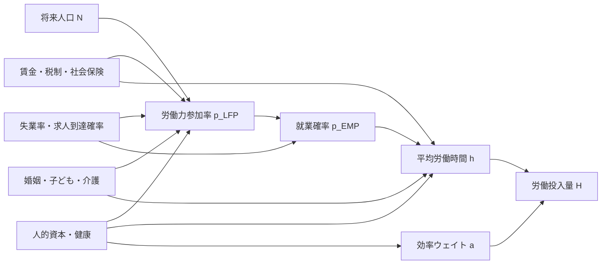
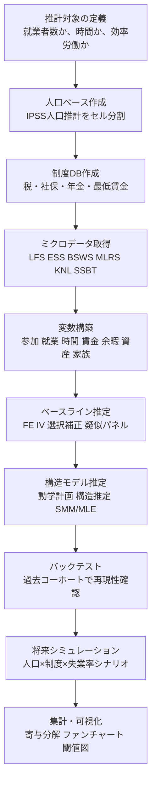

# 将来の労働投入量を労働供給側から推計するための理論・実証研究と実務手順

## エグゼクティブサマリ

**事実**

- 将来の労働投入量を労働供給側から推計するうえで、最も標準的な分解は、**人口** × **労働力参加率** × **就業確率** × **労働時間**であり、中長期ではこれに**人的資本や就業形態による効率差**を掛けた「効率労働投入」に拡張するのが理にかなっています。人口の将来値は日本では国立社会保障・人口問題研究所のコーホート要因法による将来人口推計が自然な基礎となり、厚生労働省の労働力需給推計も、労働参加と経済シナリオを組み合わせて将来の労働力人口・就業者数を見通しています。 citeturn19search1turn18search1turn19search2

- 理論研究の中核は、家計が**消費と余暇**を効用に入れ、賃金・税制・非労働所得・固定費・人的資本・失業リスクの下で**参加**と**時間**を同時に選ぶ枠組みです。静学モデルは労働供給関数の基本形を与え、ライフサイクル／動学モデルは賃金や税制変更に対する**時点間代替**、人的資本蓄積、退職・再就業を扱えるため、将来推計や政策シミュレーションに不可欠です。 citeturn22search4turn23search5turn22search1turn25search4turn25search1turn24search9

- 実証研究の蓄積は、**プライムエイジ男性の時間反応は比較的小さく、女性・高齢者・参加境界近傍の個人では広義の供給反応が大きい**こと、また**非線形な税・社会保険・年金制度**が参加・就業形態・年収分布に強い影響を与えることを示しています。日本では、配偶者控除・社会保険の被扶養閾値、在職老齢年金、継続雇用制度などが代表的な識別源です。 citeturn14search0turn14search10turn12search0turn17search5turn17search1turn22search17turn29search3turn29search6turn29search2

- 日本で実務的に最も有効なのは、**二層構造**です。すなわち、  
  **短中期予測**にはマイクロパネル／疑似パネルの固定効果・IV・選択補正モデル、  
  **制度改正の中長期効果**にはライフサイクル型の構造推定モデル、  
  を使い分ける設計が最も堅牢です。前者は更新しやすく、後者は反実仮想に強い、という補完関係があります。これは国際的な労働供給研究の方法論と、日本の公的統計の利用可能性の双方に整合的です。 citeturn24search9turn25search4turn17search0turn27search5turn18search1turn20search1

- 日本では、労働力調査、就業構造基本調査、社会生活基本調査、賃金構造基本統計調査、毎月勤労統計調査、家計調査、国民生活基礎調査などの官庁統計に加え、JHPS/KHPS、JPSC、JSTAR などの学術パネルが利用可能です。公的ミクロデータは e-Stat の **e-Micro** を通じて、オンサイト、リモートアクセス、電磁的記録媒体、匿名データ、オーダーメード集計の形で利用でき、手続は 2025 年以降、ポータルで一元化されています。 citeturn7search0turn5search6turn19search3turn6search8turn31search1turn32search0turn6search3turn10search0turn11search5turn10search2turn20search1turn8search1turn8search13

**解釈**

本件の実務では、「将来の労働投入量」を**単なる就業者数ではなく、参加・就業・時間・就業形態・人的資本を通じて決まる時間投入**として明示的に定義することが重要です。そのうえで、日本では制度閾値と高齢化の影響が大きいため、**女性・高齢者・制度境界近傍**を別建てで扱うモデル設計が、予測精度と政策含意の双方で優位です。これは既存研究と公式推計の双方から導かれる、かなり強い実務的含意です。 citeturn19search2turn29search2turn17search0turn27search1

## 推計対象の概念整理

**事実**

供給側から見た将来労働投入量は、少なくとも次の三つに区別して定義する必要があります。第一に、働く意思と利用可能時間に基づく**潜在的労働供給**。第二に、失業率や求人到達確率を織り込んだ**期待実現労働供給**。第三に、学歴・経験・就業形態の差を反映した**効率労働投入**です。厚生労働省の労働力需給推計は、需給が一致する将来値をシナリオで示す一方、「それ自体は人手不足の大きさそのものを示すものではない」と明記しており、実務では潜在供給と期待実現供給を区別する必要があります。 citeturn19search2turn19search6

本レポートでは、将来労働投入量の基本指標を次のように置きます。

\[
H_t^{S,\mathrm{exp}}
=
\sum_{x}
N_{x,t}
\cdot p^{LFP}_{x,t}
\cdot p^{EMP}_{x,t}
\cdot \bar h_{x,t},
\]

ここで \(x\) は年齢・性別・教育・婚姻・子ども・地域・就業形態などのセル、  
\(N_{x,t}\) は将来人口、\(p^{LFP}_{x,t}\) は労働力参加確率、\(p^{EMP}_{x,t}\) は就業確率、\(\bar h_{x,t}\) は就業時平均時間です。人口は IPSS の将来推計人口から与え、残りをミクロ実証または構造モデルで推計するのが日本の標準的実装です。 citeturn19search1turn18search0turn18search1

効率労働投入まで拡張する場合は、

\[
L_t^{S}
=
\sum_x
N_{x,t}
\cdot p^{LFP}_{x,t}
\cdot p^{EMP}_{x,t}
\cdot \bar h_{x,t}
\cdot a_{x,t},
\]

と置き、\(a_{x,t}\) を人的資本や雇用形態別の生産性ウェイトとします。年齢・性別で参加率・雇用形態・賃金に大きな差があることは、日本の高齢化を扱う一般均衡研究でも明示的に組み込まれています。 citeturn27search1turn27search13

余暇の定義も重要です。理論上は余暇 \(\ell\) が効用に入り、実務上は  
**直接計測**（社会生活基本調査の生活時間）か、  
**残差定義**（24時間または168時間 − 市場労働 − 通勤 − 無償労働 − 生理活動）  
のどちらかで作るのが一般的です。社会生活基本調査は 15 分単位・20 種類の行動分類を提供し、「仕事」「通勤」「無償労働」「自由時間」「休養・くつろぎ」などを直接把握できます。 citeturn19search3turn38search0turn38search6



**解釈**

政策分析や予測の現場では、「労働供給」と言いながら**参加率だけ**を見てしまうことが多いのですが、それでは日本で重要な  
- パート／フルタイムの選択  
- 103 万円・130 万円付近の年収調整  
- 高齢就業の継続／引退  
- 失業率ショックによる非参加化  
を落としてしまいます。したがって、最低限でも「参加」「就業」「時間」の三段階、制度分析では「就業形態」と「人的資本」を加えた五段階で推計するのが望ましい、というのが本レポートの基本立場です。これは日本の制度研究と動学研究の双方に整合します。 citeturn12search0turn17search1turn29search3turn27search5

## 先行研究サーベイ

**事実**

労働供給研究は、大まかに  
**静学の参加・時間選択** → **選択バイアスと影の賃金** → **ライフサイクルの Euler 方程式** → **非線形税制の構造推定** → **失業・非参加を含む動学離散選択** → **人的資本・家族・高齢化を含む構造一般均衡**  
へと発展してきました。日本の将来推計実務に関係が深いのは、特に  
- 税・社会保険閾値の非線形性  
- 高齢者の年金・継続雇用制度  
- 女性の正規／非正規選択  
- 地域失業率や労働市場の緩み  
を扱う研究群です。 citeturn22search4turn23search5turn22search1turn24search9turn16search0turn26search3turn29search2turn27search5

以下の表では、代表的な理論・実証研究を、**年代順・方法論別**に整理します。表中の式は、原論文の核となる構造を本報告用に簡約化したものです。 citeturn23search3turn24search9

### 理論系譜の比較

| 方法論 | 代表研究 | 家計効用・状態変数 | 代表式の骨格 | 解法・推定 | 将来推計への示唆 | 主な出典 |
|---|---|---|---|---|---|---|
| 静学参加モデル | Mincer (1962) | 余暇・家事・市場労働の配分 | \(\max U(c,\ell,home)\), \(c=y+wh\) | 参加率・就業選択の比較静学 | 参加率の基礎分解に必須。家事時間を明示した点が日本の女性就業分析と親和的 | citeturn22search0turn22search4 |
| 影の賃金・参加／時間同時決定 | Heckman (1974) | 参加、時間、観察賃金、影の賃金 | 参加確率・時間・賃金式を共通パラメータで結合 | 同時方程式的推定、選択問題の統合 | 非就業者の賃金オファー推定、参加と時間の同時推計の出発点 | citeturn23search1turn23search5 |
| 選択バイアス補正 | Heckman (1977) | 就業者サンプル非ランダム | \(E[\varepsilon|D=1]\neq 0\) を補正 | 2段階選択補正 | 非就業者の賃金欠測が大きい日本データで実務重要 | citeturn23search0turn23search4 |
| 固定費つき参加 | Cogan (1980/81) | 市場参加の固定費、予約労働時間 | \(U(y,T)\) と \(U(y+wh-F,T-h)\) の比較 | 構造推定 | パート／フルの最小時間や保育・通勤固定費を扱いやすい | citeturn22search1turn22search9 |
| ライフサイクル・人的資本 | Shaw (1989), Imai & Keane (2004) | 資産、人的資本、経験、賃金経路 | \(k_{t+1}=(1-\delta)k_t+g(h_t)\), Euler 条件 | GMM・構造推定 | 年齢別賃金・時間・就業経路を同時に再現でき、中期予測に強い | citeturn25search1turn25search4turn25search8 |
| 非線形税制・政策評価 | Blundell, Duncan & Meghir (1998) | 税・給付制度の非線形予算制約 | \(c = y + B(h,w)-T(h,w)\) | グルーピング推定、政策改革利用 | 配偶者控除・社会保険閾値の日本分析に直結 | citeturn22search15turn22search19turn24search9 |
| 失業・非参加・怯み効果 | Haan (2007), Dagsvik et al. (2013) | 参加、時間、非自発的失業、ジョブオファー | \(Pr(search/work)=f(w,u,x)\) | 動学モデル、参加関数推定 | 失業率ショックを供給側予測へ組み込むときの標準枠組み | citeturn16search3turn16search0turn16search4 |
| マクロ・OLG・集計弾力性 | Prescott (2004), Rogerson & Wallenius (2009), Peterman (2016) | 税率、 indivisible labor、年齢構成 | \(N_t,H_t\) を一般均衡で決定 | キャリブレーション、定量モデル | ミクロ弾力性とマクロ弾力性の違い、税制・高齢化の集計効果を評価 | citeturn26search0turn26search3turn26search17 |

### 主要論文の比較

| 論文 | 焦点 | モデル式の要点 | 推定手法 | データ | 実務的含意 | 出典 |
|---|---|---|---|---|---|---|
| Mincer (1962) | 有配偶女性の労働力参加 | 家事・余暇・市場労働の三分配 | 参加行動の理論化 | 女性労働の古典的ミクロ分析 | 参加率を家計内時間配分として扱う原点 | citeturn22search0turn22search4 |
| Heckman (1974) | 賃金・参加・時間の同時推定 | 参加、観察賃金、影の賃金、時間の共通パラメータ | 同時推定 | 女性労働データ | 非就業者の欠測賃金補完に不可欠 | citeturn23search1turn23search5 |
| Cogan (1981) | 固定費と予約労働時間 | 固定費 \(F\) による角点・最小時間 | 理論＋実証 | 有配偶女性 | パート／フルの最小拘束時間の定式化に有用 | citeturn22search1turn22search13 |
| Shaw (1989) | 人的資本を含むライフサイクル供給 | \(k_{t+1}=(1-\delta)k_t+g(h_t)\) | Euler 条件に基づく構造推定 | PSID 男性パネル | 経験蓄積を無視すると弾力性が歪む | citeturn25search1 |
| Imai & Keane (2004) | 時点間代替と人的資本 | 賃金上昇と人的資本蓄積を同時内生化 | 構造推定 | ライフサイクル労働データ | 中長期予測では人的資本を入れるべき | citeturn25search0turn25search4 |
| Haan (2007) | 非自発的失業を含む労働供給 | 参加・時間・失業制約の動学枠組み | 動学構造推定 | ドイツ系ミクロデータ | 失業率を外生制約として入れる手本 | citeturn16search3 |
| Dagsvik et al. (2013) | 非参加と discouraged worker 効果 | 参加率を労働市場の緩みと結合 | 構造参加モデル | 参加データ | 失業率上昇が非参加を増やす経路に有用 | citeturn16search0turn16search4 |
| Prescott (2004) / Rogerson & Wallenius (2009) | 税・集計時間・ extensive margin | 税率が集計時間に影響、雇用率と時間を分離 | 定量マクロ・ライフサイクル | 国際比較・理論データ | 日本の高齢化・税制改革を集計評価するときに有用 | citeturn26search0turn26search3turn26search23 |

### 日本関連研究の比較

| 論文 | 焦点 | モデル式の要点 | 推定手法 | データ | 主要含意 | 出典 |
|---|---|---|---|---|---|---|
| Kuroda & Yamamoto (2008) | 日本の Frisch 弾力性 | ライフサイクル型の Frisch 弾力性、参加と時間に分解 | 集計パネルに基づく推定 | 1990年代の都道府県×年齢×性別集計 | 男性 0.2–0.7、女性 1.3–1.5 程度という日本の基準値を提供 | citeturn14search0turn14search10turn15search3 |
| Akabayashi (2006) | 配偶者控除下の既婚女性供給 | ピースワイズ線形予算制約 | 構造推定 | 日本の有配偶女性クロスセクション | 税・社会保険の非線形性を明示しない回帰は危険 | citeturn17search5 |
| 高橋 (2010) | 配偶者控除・社会保険と既婚女性 | 非凸・非連続な予算制約線 | 構造推定 | JPSC | 閾値周辺での労働抑制を政策比較可能な形で推計 | citeturn12search0 |
| 石井・黒澤 (2009) | 年金制度改正と男性高齢者 | 就業・時間・年金受給開始の応答 | 労働供給モデル＋シミュレーション | 高齢男性ミクロデータ | 受給開始年齢や在職老齢年金は高齢就業に無視できない | citeturn29search6turn29search10 |
| Shimizutani & Oshio (2013) | 在職老齢年金の労働抑制効果 | earnings test と労働供給を結合 | ミクロ実証 | 高齢者就業の全国調査 | 制度改正前後比較で高齢就業の抑制／緩和を評価 | citeturn29search3turn12search7 |
| Kuroda & Yamamoto (2011) | 希望労働時間と時間弾力性 | 仮想質問に基づく希望時間 | 比較ミクロ実証 | 日英独比較調査 | 実績時間だけでなく「希望時間」も必要 | citeturn14search20turn30search1 |
| Yokoyama (2015) | 税制改革と既婚女性の労働時間・所得 | 税改正が分布に与える異質効果 | 分位差分の差分・分解 | 日本の既婚女性データ | 改革効果は平均でなく分布で見る必要 | citeturn28search4turn28search0 |
| Kondo & Fukai (2023) | 103万円・130万円閾値での bunching | 税 schedule の kink / 社保 notch | 管理データ実証 | 自治体税務記録 | 閾値周辺の年収調整は実在し、制度変更で移動する | citeturn17search1turn22search17 |
| Kitao & Mikoshiba (2022/2024) | 女性のライフサイクル就業・正規/非正規 | 非就業・正規・非正規の選択と人的資本蓄積 | 構造ライフサイクルモデル | 女性パネルデータ | 配偶者控除・社保免除・遺族年金の廃止で就業・所得が上がる | citeturn17search0turn27search5turn17search4 |
| Kitao (2019) / Kitao (2026) | 高齢化・女性労働・家族形成の一般均衡 | 年齢・性別別参加率、雇用形態、結婚・出生を内生化 | ヘテロ個人一般均衡・ライフサイクル | 日本向け定量モデル | 将来労働投入量の集計予測には OLG/家族形成の拡張が有効 | citeturn27search1turn27search13turn27search0turn28search8 |

**解釈**

サーベイから得られる方法論上の要点は三つです。  
第一に、**日本の制度閾値**を無視した滑らかな供給関数は、パートタイム比率や年収分布をかなり取り違えます。  
第二に、将来推計では、年齢とともに賃金・経験・健康・家族構成が変わるため、**静学モデルだけでは不十分**です。  
第三に、失業率や非参加を入れたいなら、単純な就業率予測ではなく、**参加方程式と就業条件付き時間方程式を分ける**必要があります。これが、本件のモデル提案に直結します。 citeturn12search0turn17search1turn25search4turn29search3turn16search0

## モデル提案

**事実**

ここでは、将来推計に使いやすく、かつ日本の制度とデータに適合しやすいモデルを二案提示します。第一案は**ライフサイクル動学的最適化モデル**、第二案は**短期マイクロパネル固定効果モデル＋動学的選択バイアス補正**です。前者は政策反実仮想に強く、後者は更新頻度と実装容易性に優れます。国際的には、人的資本を含むライフサイクル構造推定と、固定効果・IV・政策改革利用のミクロ計量は補完関係にあります。 citeturn25search4turn24search9turn17search0turn27search5

### 提案モデルの比較

| モデル | 向く用途 | 強み | 弱み | 必要データ | 推奨期間 |
|---|---|---|---|---|---|
| ライフサイクル動学的最適化 | 中長期予測、制度改革評価、就業形態変化 | 政策変更の反実仮想に強い、年齢別プロファイルを再現可能 | 計算コスト大、識別に厚いデータが必要 | パネルまたは豊富な反復横断＋制度情報 | 10〜30年 |
| 短期マイクロパネル FE＋選択補正 | 短中期予測、定期更新、速報分析 | 推定・更新が速い、説明可能性が高い | 大改正の反実仮想には弱い、動学の深さが限られる | 短期パネル、疑似パネル、地域マクロ | 1〜10年 |

**解釈**

両者は競合ではなく、**ベースライン予測を第二案、制度シナリオ評価を第一案**で行うのが最も実務的です。日本の公的統計は長期真のパネルが限られる一方、反復横断面と制度情報は豊富なので、この二層構造が最も現実的です。 citeturn20search1turn18search1turn10search0turn11search5

**モデル案 A**

年齢 \(t=1,\dots,T\)、個人状態 \(s_t=(a_t,k_t,m_t,n_t,r_t,\varepsilon_t)\) のもとで、個人が  
\(j_t\in\{0,\text{pt},\text{ft}\}\)（非就業・パート・フルタイム）、  
労働時間 \(h_t\)、消費 \(c_t\)、次期資産 \(a_{t+1}\)  
を選ぶとします。

\[
V_t(s_t)=
\max_{j_t,h_t,c_t,a_{t+1}}
\left\{
u(c_t,\ell_t; \eta_i)
- F(j_t,n_t)
+ \beta E_t[V_{t+1}(s_{t+1})]
\right\}
\]

制約は

\[
a_{t+1}
=
(1+r_t)a_t
+
y_t^{nonlab}
+
w_t(k_t,r_t,j_t)\,h_t
-
T_t\!\left(w_t h_t, y_t^{sp},\text{制度}_t\right)
-
CC_t(n_t,j_t)
-
c_t,
\]

\[
k_{t+1}=(1-\delta_k)k_t + g(j_t,h_t,k_t),
\qquad
\ell_t=\bar T - h_t - q(j_t,n_t)-home_t,
\]

です。ここで \(F(\cdot)\) は参加固定費、\(CC_t\) は保育・介護・通勤等の金銭費用、\(q(\cdot)\) は時間固定費、\(T_t(\cdot)\) は配偶者控除、社会保険料、年金制度を含む非線形税・給付関数です。就業機会の制約を入れるなら、

\[
Pr(j_t\neq 0 \mid s_t)=\Lambda(\alpha_0+\alpha_1 u_{r,t-1}+\alpha_2 v_{r,t-1}+\alpha_3 x_t)
\]

のように、地域失業率 \(u\) や有効求人倍率 \(v\) をジョブオファー到達確率に入れます。これは Haan や Dagsvik の枠組み、日本では Kitao・Mikoshiba 型の女性ライフサイクルモデル、高齢化一般均衡モデルと整合的です。 citeturn16search3turn16search0turn25search4turn27search5turn27search13

**仮定**

- 効用は消費増加で増え、余暇減少で減る。  
- 参加固定費は子ども・介護・通勤で変化する。  
- 賃金は人的資本 \(k_t\) と就業形態 \(j_t\) に依存する。  
- 税・社会保険・年金は制度年次ごとに外生的に与える。  
- 失業率は個人には外生な地域労働市場条件として入れる。 citeturn24search9turn17search0turn29search3

**境界条件**

- 終端条件は \(a_{T+1}\ge 0\) の no-Ponzi 条件または推定された遺産効用。  
- 初期人的資本 \(k_1\) は学歴・初職・出生コーホートで分布化。  
- 退職年齢は外生固定ではなく、年金受給権発生年齢以後も選択可能。 citeturn25search7turn29search6turn29search3

**期待される反応**

- **賃金弾力性**は、プライムエイジ男性では小さく、女性・高齢者では参加マージンを通じて大きくなる可能性が高い。 citeturn14search10turn29search2
- **失業率ショック**は、就業確率の低下だけでなく、非参加化を通じた discouraged worker 効果を生みうる。 citeturn16search0turn16search3
- **非線形性**は、103万円・130万円、年金 earnings test、最低賃金近傍で強くなる。 citeturn17search1turn12search0turn28search5
- **異質性**は、婚姻、子どもの年齢、教育、地域、正規／非正規履歴で大きい。 citeturn17search0turn27search0turn27search1

**モデル案 B**

短期パネルまたは疑似パネルで、雇用状態 \(S_{it}\in\{\text{N},\text{U},\text{PT},\text{FT}\}\) を動学的多項選択、就業者の労働時間を固定効果＋選択補正で推定する案です。

状態方程式を

\[
Pr(S_{it}=m \mid S_{i,t-1},X_{it},\alpha_i)
=
\frac{\exp\left(\alpha_{im}+\rho_m S_{i,t-1}+\beta_m \ln \hat w_{it}+\gamma_m u_{r,t-1}+X'_{it}\delta_m\right)}
{\sum_{k}\exp\left(\alpha_{ik}+\rho_k S_{i,t-1}+\beta_k \ln \hat w_{it}+\gamma_k u_{r,t-1}+X'_{it}\delta_k\right)}
\]

とし、就業者の時間方程式を

\[
\ln h_{it}
=
\mu_i
+
\theta \ln h_{i,t-1}
+
\eta \ln \hat w_{it}
+
\kappa u_{r,t-1}
+
\pi \mathbf{1}(PT_{it})
+
f(\text{threshold}_{it})
+
\lambda \widehat{CF}_{it}
+
X'_{it}\tau
+
\varepsilon_{it},
\]

と置きます。ここで \(\hat w_{it}\) は賃金オファー予測、\(\widehat{CF}_{it}\) は第1段階から得た control function または逆 Mills 比、\(f(\cdot)\) は税・社会保険・年金の閾値周辺を表す spline / notch / kink 項です。Heckman 型選択補正、税制改革 DID、分位差分の差分、固定効果 IV と組み合わせることで、日本の短中期予測や制度閾値分析に即応できます。 citeturn23search0turn28search4turn17search1turn22search17

**仮定**

- 5〜10年程度の短期変動では、深い選好パラメータよりも**個人固定効果**と**制度・地域ショック**の説明力が高い。  
- 就業状態には状態依存がある。  
- 非就業者の賃金オファーは観察不能なので予測値で補完する。  
- 地域失業率は少なくとも 1 期ラグを用いて同時性を弱める。 citeturn23search0turn16search0turn14search20

**境界条件**

- 真の長期最適化は近似せず、予測 horizon は 1〜10 年。  
- 長期人口は外生的に与え、短中期行動反応のみモデルで捕捉する。  

**期待される反応**

- 賃金上昇の効果は、主として**参加境界**と**パート→フル移行**で出る。  
- 失業率上昇は、失業増加だけでなく、**PT/FT から非参加への移行確率**を上げる。  
- 閾値縮小や廃止の効果は、**時間分布の裾**よりも**閾値近傍の山の移動**として現れる。 citeturn17search1turn22search17turn28search4

## 推定戦略

**事実**

識別の難所は、**賃金の内生性**、**非就業者賃金の欠測**、**政策変更の同時性**、**失業率が需要側要因でもあること**、そして**労働時間の測定誤差**です。既存研究はこれに対し、制度改革、閾値、地域差、年齢・コーホート差、管理データ、パネル構造を使って識別してきました。 citeturn23search0turn22search19turn17search1turn29search3

### 識別マップ

| 識別対象 | 必要条件 | 主な識別源 | 日本での実装候補 | 関連研究 |
|---|---|---|---|---|
| 自己賃金弾力性 | 賃金の外生変動 | 税制改革、最低賃金、地域×産業ショック、予測賃金 IV | 地域別最低賃金、産業別需要ショック、制度改正年次 | citeturn22search19turn28search4turn31search2 |
| 参加マージン | 角点・選択補正 | Heckman 補正、閾値、制度 eligibility | 103万円・130万円、年金受給年齢、保育可用性 | citeturn23search0turn12search0turn17search1turn29search6 |
| 失業率ショック | 需要との分離 | ラグ付き失業率、Bartik、求人倍率 | \(u_{r,t-1}\)、有効求人倍率、県別需要指標 | citeturn16search0turn16search3turn7search1 |
| パート／フル選択 | 離散選択の識別 | 閾値、企業の時間制約、過去状態 | 正規/非正規、希望時間、不一致指標 | citeturn17search0turn30search3turn30search11 |
| 高齢就業・引退 | 制度年齢・ earnings test | 年金制度改正、継続雇用制度 | 定額部分受給開始年齢、在職老齢年金 | citeturn12search4turn29search3turn29search6 |

**推定手法**

- **GMM / Euler 方程式法**  
  人的資本を含むライフサイクルモデルでは、Euler 条件から Frisch 弾力性や人的資本効果を識別できます。利点は構造の透明性、弱点は測定誤差への脆弱性です。 citeturn25search1turn25search4

- **MLE / 構造推定 / SMM**  
  非線形税制、参加固定費、就業形態、結婚・出生を含めるなら、MLE や simulated moments が適します。政策反実仮想に最も強い一方、計算負荷は大きいです。 citeturn17search0turn27search0turn25search7

- **パネル IV / 固定効果**  
  定期更新を重視する場合は、固定効果や correlated random effects による賃金弾力性・失業率効果推定が有効です。賃金の内生性は IV で、非就業者賃金は予測賃金で補います。 citeturn23search0turn22search19turn28search4

- **マッチング / DID / 分位 DID**  
  制度改正の実証には、対象群・対照群設計、変化率の比較、分布全体の比較が有効です。日本の配偶者控除改革や年金制度改革の分析はこの系統と親和的です。 citeturn28search4turn29search3

- **選択モデル**  
  Heckman 2段階、control function、IPW、動学的 initial conditions 補正が中心です。非就業者の賃金欠測が大きい日本の女性・高齢者分析では必須です。 citeturn23search0turn23search4

**推定可能性の検討**

公的統計だけでも、反復横断と地域集計を併用すれば、  
- 年齢×性別×教育×地域セルの疑似パネル、  
- 地域失業率・最低賃金・制度年次の外生変動、  
- 参加・就業・時間の分解、  
は十分に可能です。真の長期パネルが必要な構造推定は、JHPS/KHPS、JPSC、JSTAR などの学術パネルや、自治体税務記録・年金行政記録との協定利用が望ましいです。 citeturn10search0turn11search5turn10search2turn17search1turn9search9

**モデル選択基準**

1. **予測目的との整合性**  
   年次更新か、制度改正の評価か。  
2. **データ可用性**  
   真のパネルか、反復横断か。  
3. **外的妥当性**  
   年齢プロファイル、時間分布、閾値周辺の山、退出・再参入を再現できるか。  
4. **計算可能性**  
   手元の計算資源で定期更新可能か。  
5. **説明可能性**  
   政策担当者に分解結果を説明しやすいか。  

**ロバストネス・チェック案**

- 賃金定義の変更：所定内給与ベース、年収/年労働時間ベース、観察賃金 vs 予測賃金。  
- 労働時間定義の変更：通常週間時間、実労働時間、年換算時間。  
- 余暇定義の変更：直接計測 vs 残差定義。  
- 地域ショックの変更：失業率、求人倍率、産業別需要ショック。  
- 閾値指定の変更：103/106/130 万円、年金 threshold。  
- サンプル変更：有配偶女性のみ、子ども年齢別、高齢者のみ。  
- 事前トレンド検証と placebo reform。  
- 疑似パネルと真のパネルの結果比較。 citeturn19search3turn31search1turn17search1turn29search3

**解釈**

日本で実務的に最も説得力が高い識別は、一般に「賃金そのもの」よりも、**制度がつくる閾値・年齢境界・改革時点**から来ます。したがって、標準的な連続変数回帰だけでなく、**kink/notch、DID、分位回帰、bunching、選択補正**を組み合わせるのが望ましいです。特に有配偶女性と高齢者ではこの必要性が高いです。 citeturn17search1turn22search17turn29search2turn12search0

## 必要データと日本での入手先

**事実**

将来推計に必要な変数は、最低限でも  
**労働時間、参加・就業状態、時給、失業率、家計属性、資産、年齢、教育、産業、就業形態、地域、制度変数、健康・介護、家事・育児・通勤、余暇**  
です。余暇は社会生活基本調査の直接観測が最良で、他データでは時間制約からの残差推定が実務的です。 citeturn19search3turn38search0turn38search6

### 変数一覧

| 変数 | 推奨定義 | 第一次ソース | 補助ソース | 備考 |
|---|---|---|---|---|
| 労働時間 | 週間実労働時間、年間換算時間、所定内・所定外 | 労働力調査、毎月勤労統計、就業構造基本調査 | 賃金構造基本統計調査 | 個人分析は LFS/ESS、景気循環は MLRS が強い citeturn7search1turn31search1turn5search6 |
| 余暇 | 直接計測または 168 時間残差 | 社会生活基本調査 | JHPS/KHPS、JPSC | 通勤・無償労働を差し引く残差定義が実務的 citeturn19search3turn38search0turn38search6 |
| 時給 | 所定内給与/所定内時間、年収/年時間 | 賃金構造基本統計調査 | 毎月勤労統計、家計調査 | 非就業者は予測賃金を作成 citeturn6search2turn31search1 |
| 失業率 | 地域別・ラグ付き完全失業率 | 労働力調査 | 求人倍率等 | 需要側との同時性を避けるためラグ利用が基本 citeturn7search1turn7search0 |
| 非参加・就業状態 | 労働力人口／非労働力、失業、非正規理由 | 労働力調査 | 就業構造基本調査 | 状態遷移モデルの基礎 citeturn7search1turn5search6 |
| 就業形態 | 正規/非正規、一般/短時間、パート/フル | 賃金構造基本統計調査、就業構造基本調査 | JPSC、JHPS | 日本では制度閾値との連動が強い citeturn5search1turn5search6turn11search5 |
| 家計属性 | 婚姻、子ども、介護、世帯構成 | 国民生活基礎調査 | JPSC、JHPS、21世紀成年者縦断調査 | 女性・高齢者分析の中核 citeturn6search3turn11search5turn10search0turn6search1 |
| 資産・負債 | 金融資産、借入、非労働所得 | 家計調査 | JHPS/KHPS、JPSC | 動学モデルの資産制約に必要 citeturn32search0turn10search0turn11search5 |
| 教育・産業・職業・地域 | 学歴、産業、職業、都道府県・市区町村 | 就業構造基本調査、賃金構造基本統計調査 | 国勢調査 | セル別将来推計に不可欠 citeturn5search6turn5search1turn32search14 |
| 制度変数 | 税率表、配偶者控除、社保適用、年金受給年齢、最低賃金 | 制度資料＋研究用コーディング | MHLW、地方税制度 | 年次別制度 DB を別建てで作る必要 citeturn17search1turn29search3turn31search2 |
| 健康・介護 | 就業制約、要介護、主観的健康 | 国民生活基礎調査、JSTAR | 中高年者縦断調査 | 高齢就業と退出の主要規定要因 citeturn6search3turn10search2 |

### 日本での入手先

| データ | 主変数 | 期間・頻度 | 代表性 | 入手経路 | 制約・費用・匿名化 | 出典 |
|---|---|---|---|---|---|---|
| 労働力調査 | 就業、失業、非労働力、非正規理由 | 毎月、全国約4万世帯 | 全国代表 | 集計表は stat.go.jp/e-Stat、個票は匿名データ・調査票情報 | 匿名データは 2023 年分まで提供開始、個票利用は e-Micro 申出 | citeturn7search0turn7search1turn21search10 |
| 就業構造基本調査 | 15歳以上の就業・不就業、職業・就業形態・時間 | 5年ごと、約54万住戸 | 全国・地域代表 | e-Stat、個票はオンサイト等 | 2022 年調査の調査票利用開始、長期系列あり | citeturn32search2turn5search6turn21search8 |
| 社会生活基本調査 | 生活時間、通勤、家事、自由時間、休養 | 5年ごと、2026 年予定は約9.5万世帯・約19.4万人 | 全国代表 | e-Stat、詳細表、個票は e-Micro 対象年次確認 | 余暇の直接計測に最適 | citeturn32search1turn19search3turn38search0 |
| 賃金構造基本統計調査 | 賃金、雇用形態、短時間/一般、年齢、学歴 | 毎年6月時点 | 主要産業雇用者 | e-Stat、公表資料、個票利用は年次確認 | 賃金オファー関数の主データ | citeturn6search2turn5search1turn5search5 |
| 毎月勤労統計調査 | 名目・実質賃金、総実労働時間、所定内/所定外 | 毎月、約3.3万事業所 | 事業所代表 | e-Stat、MHLW | 景気循環・時間指数に強い。個票利用は最新提供状況確認 | citeturn31search1turn31search7 |
| 家計調査 | 収入・支出、貯蓄・負債 | 毎月、全国約9千世帯 | 全国代表 | stat.go.jp/e-Stat、個票は e-Micro | 非労働所得・資産の把握に有用 | citeturn32search0turn32search9 |
| 国民生活基礎調査 | 所得、世帯構成、健康、介護、年金 | 毎年、中間年と大規模年で規模差 | 全国代表 | MHLW、公表資料、匿名データ・調査票情報 | 2024 年中間年は世帯票約6.1万世帯、所得票約7千世帯。2022 年大規模年は世帯・健康票約30万世帯 | citeturn34search2turn34search5turn6search3 |
| 21世紀成年者縦断調査 | 出産前後の就業、家族変化 | 年次パネル | コーホート代表 | MHLW | 真のパネルとして女性就業継続に有用 | citeturn6search1turn6search4turn6search14 |
| JHPS/KHPS | 就業、所得、資産、家族、健康 | 年次パネル、2004年以降 | 全国パネル | 慶應 PDRC 申請 | 承認ユーザーは DMS からダウンロード、利用料なし | citeturn10search0turn11search0 |
| JPSC | 女性の就業、家計、家族関係 | 1993–2021 年次パネル | 全国女性パネル | 慶應 PDRC オンライン申請 | 長期女性パネル。定期調査は 2021 で完了 | citeturn11search5turn11search13turn10search17 |
| JSTAR | 50歳以上の就業、健康、資産 | パネル | 中高年対象 | RIETI 申請 | 研究目的限定、機微情報は高い秘匿管理・トップコーディング | citeturn10search2turn11search7turn11search11 |
| 行政記録ベース | 自治体税務記録、年金被保険者・受給者記録 | 年次〜月次 | 高精度だが制度・協定依存 | 個別研究協定、特別集計 | 一般定型アクセスは限定的。制度閾値研究に強い | citeturn17search1turn9search9turn9search15 |

公的ミクロデータの利用形態は、**オンサイト利用**（全項目）、**リモートアクセス**（研究に必要な項目）、**電磁的記録媒体による提供**、**匿名データ**、**オーダーメード集計**に分かれます。e-Micro で電子申出が可能で、オンサイト施設は全国約 20 か所、オンサイト手数料の基準は事務時間 1 時間ごと 4,400 円です。オーダーメード集計は改正統計法の下で利用範囲拡大と手数料見直しが行われています。 citeturn20search1turn20search2turn20search5turn8search4turn8search0turn8search13

**解釈**

実務では、**単一データで完結させようとしない**ことが重要です。  
- 参加・失業・就業形態は **労働力調査／就業構造基本調査**、  
- 賃金は **賃金構造基本統計調査**、  
- 時間と余暇は **社会生活基本調査／毎月勤労統計**、  
- 家計背景と健康は **国民生活基礎調査／家計調査**、  
- 動学推定は **JHPS/KHPS・JPSC・JSTAR**、  
という**分業**で考えると、推計設計が急に安定します。 citeturn7search0turn5search6turn6search2turn19search3turn31search1turn6search3turn10search0turn11search5turn10search2

## 実装計画

**事実**

将来労働投入量の供給側推計は、実装順序を誤ると、後からモデルをどれだけ精緻化しても整合性が崩れます。特に日本では、**人口投影**、**制度データベース**、**ミクロ行動式**、**時間・余暇定義**を同じセル体系にそろえることが最優先です。人口基礎は IPSS、集計セルの行動方程式は労働力調査・就業構造基本調査・賃金構造基本統計調査など、制度シナリオは MHLW/税制資料を年次別にコーディングするのが基本です。 citeturn19search1turn18search1turn7search0turn5search6turn6search2



### ステップ順序

1. **推計対象を固定する**  
   「就業者数」ではなく、「年労働時間」か「効率労働投入」かを最初に決めます。  
2. **セル体系を固定する**  
   性別 × 年齢階級 × 教育 × 婚姻 × 子年齢 × 地域 × 就業形態を基本セルにします。  
3. **人口ベースを IPSS から展開する**  
   2021–2070 の全国推計、必要なら 2050 までの地域別推計を接続します。 citeturn19search1turn18search4
4. **制度 DB を年次別に作る**  
   税率表、配偶者控除、社保適用、年金受給年齢、最低賃金、継続雇用制度等をコード化します。 citeturn17search1turn29search3turn31search2
5. **賃金オファー関数を推定する**  
   非就業者も含めて賃金オファーを定義できるよう、賃金構造基本統計調査や就業者サンプルから賃金式を推定し、選択補正を行います。 citeturn23search0turn6search2
6. **参加・就業・時間の三段階を推定する**  
   参加方程式、就業状態方程式、就業条件付き時間方程式を分けます。  
7. **バックテストする**  
   例として 2010 年までで推定し、2011–2025 年を外挿し、年齢×性別×地域別の参加率・就業率・時間を比較します。  
8. **将来シナリオを回す**  
   基準、賃金上昇、失業率ショック、閾値改革、高齢就業促進、保育制約緩和等を比較します。  

### 計算上の注意

- **非凸予算制約**  
  103万円・130万円などの閾値があると、連続時間の一階条件だけでは足りず、**離散 hours grid** や global search が必要です。 citeturn12search0turn17search1
- **動学計画の状態爆発**  
  資産 × 人的資本 × 婚姻 × 子ども × 地域 × 就業形態を全部持つと状態が急増するので、補間、sparse grid、近似価値関数が必要です。構造研究では一般的です。 citeturn25search7turn27search5
- **測定誤差**  
  労働時間と賃金には報告誤差があるため、所定内給与・所定内時間を優先し、年収÷年時間は補助指標にとどめるのが安全です。 citeturn6search2turn31search1
- **政策同時性**  
  税制・社保・年金・最低賃金・景気ショックが同時に動く年は、単一改革の効果と解釈しないことが重要です。 citeturn28search4turn29search3

### ソフトウェア推奨

| 用途 | 推奨ソフト | 理由 | 出典 |
|---|---|---|---|
| 大規模データ整形・固定効果・IV | **R** | `data.table` は大規模集計に強く、`fixest` は FE/IV/GLM/ML に強い | citeturn36search2turn35search0 |
| 非線形ランダム効果・構造推定 | **R** | `TMB` は自動微分・Laplace 近似・並列化を持つ | citeturn36search0turn36search4 |
| 再現可能なワークフロー | **R** | `targets` は依存関係をもつ再計算を効率化 | citeturn36search3 |
| 標準計量・迅速な検証 | **Stata** | 統計、可視化、データ管理を統合的に実行しやすい | citeturn35search3 |
| 線形・GLM・パネル IV | **Python** | `statsmodels` と `linearmodels` が豊富 | citeturn35search1turn35search13 |
| 動学計画・最適化 | **Julia** | `QuantEcon.jl`、`JuMP`、`Ipopt`、`Optim.jl` が定量モデルに向く | citeturn35search10turn37search5turn37search3turn37search6 |

### 擬似コード

```r
# 1. 人口ベース
pop <- read_ipss_projection()   # age x sex x region x year

# 2. 制度DB
inst <- build_policy_database() # 税・社保・年金・最低賃金

# 3. ミクロデータ
lfs  <- load_lfs_micro()
ess  <- load_ess_micro()
bsws <- load_bsws_micro()
knl  <- load_knl_micro()
stus <- load_time_use()

# 4. 変数作成
micro <- harmonize_cells(lfs, ess, bsws, knl, stus, inst)
micro <- construct_wage_offer(micro)      # 非就業者賃金予測
micro <- construct_leisure(micro)         # 直接 or 残差
micro <- construct_states(micro)          # N/U/PT/FT

# 5. ベースライン推定
m_part  <- estimate_participation_model(micro)
m_state <- estimate_employment_state_model(micro)
m_hours <- estimate_hours_model(micro)

# 6. 構造推定
theta <- estimate_lifecycle_model(micro, inst)

# 7. 将来シミュレーション
pred_micro <- simulate_behavior(pop, inst, m_part, m_state, m_hours, theta)

# 8. 集計
forecast <- aggregate_labor_input(pred_micro,
                                  metric = c("hours","efficiency_hours"))

# 9. 出力
make_tables_and_figures(forecast)
```

**解釈**

技術的には第一案のほうが「美しい」のですが、定期改定が必要な行政実務では、**第二案を毎年更新し、第一案は制度改正時に再推定する**のが費用対効果に優れます。R を中心にして、重い構造推定だけ TMB や Julia に逃がす設計が現実的です。 citeturn36search4turn37search5turn37search3

## 課題、出力設計、簡易シミュレーション

**事実**

日本の将来労働投入推計で繰り返し出る問題は、**選択バイアス、測定誤差、政策変化の同時性、構造変化、希望時間と実績時間の乖離、利用制約**です。既存研究は、それぞれに対してかなり標準化された対処法を提示しています。 citeturn23search0turn30search1turn30search3turn29search2

### 課題と解決策

| 課題 | なぜ深刻か | 実務的解決策 | 関連出典 |
|---|---|---|---|
| 選択バイアス | 非就業者の賃金が観測されない | Heckman 2段階、control function、IPW、予測賃金 | citeturn23search0turn23search4 |
| 労働時間・賃金の測定誤差 | 年収÷年時間で誤差が増幅 | 所定内給与と所定内時間を優先、複数定義で頑健性確認 | citeturn6search2turn31search1 |
| 政策変化の同時性 | 税・社保・年金・景気が同時に動く | DID＋event study＋placebo、制度別分離推定 | citeturn28search4turn29search3 |
| 構造変化 | 1990年代と現在では女性就業・非正規が異なる | パラメータの時変化、ローリング推定、コーホート別推定 | citeturn17search0turn27search0 |
| 希望時間と実績時間の乖離 | 実績時間だけでは供給意思を誤る | 希望時間調査や時間ミスマッチ指標を併用 | citeturn30search1turn30search11 |
| 失業率の需要側混入 | 供給モデルなのに需要ショックを拾う | ラグ付き失業率、Bartik、求人倍率併用 | citeturn16search0turn16search3turn7search1 |
| 秘匿・アクセス制約 | 管理データは高精度だが利用が難しい | 官庁統計＋学術パネルの代替設計、匿名データ活用 | citeturn20search1turn21search7turn11search0turn11search5 |

### 推計結果の提示方法

政策文書・研究報告で最低限必要なのは、次の図表です。

| 出力 | 推奨形式 | 目的 |
|---|---|---|
| 年齢×性別×教育別の参加率・就業率・時間 | 折れ線図 | ライフサイクル整合性の確認 |
| 弾力性推定結果 | 表 | 主要パラメータの比較 |
| N/U/PT/FT の遷移 | ヒートマップ | 状態依存の可視化 |
| 閾値近傍の年収分布 | ヒストグラム・密度図 | bunching/notch の確認 |
| 将来労働投入 | ファンチャート | シナリオ不確実性の提示 |
| 寄与分解 | ウォーターフォール図 | 人口要因、参加要因、時間要因の分離 |
| 制度改革シナリオ | 比較表 | 反実仮想の政策比較 |

**解釈**

供給側推計の結果は、**単一の総量値だけ**を示すと誤解されやすいです。最も重要なのは、  
- 人口減少でどれだけ減るか、  
- 参加上昇でどれだけ補えるか、  
- その補いがパート増なのかフルタイム増なのか、  
- 高齢者・女性の寄与がどの程度か、  
を分解して見せることです。この分解があって初めて、政策選択に耐えるレポートになります。 citeturn19search2turn27search1

### 想定データによる簡易シミュレーション例

以下は、**モデル案 B の仮想パラメータ**を用いた説明用シミュレーションです。対象は「30〜49歳・有配偶女性」の代表セル、基準時点で参加確率 0.68、就業時年労働時間 1,100 時間とします。数値は**実証結果ではなく、出力設計の例示**です。

| シナリオ | 参加確率 | 就業時年労働時間 | 期待年労働投入 \(p \times h\) | 読み方 |
|---|---:|---:|---:|---|
| 基準 | 0.680 | 1,100 | 748 | 現状基準 |
| 賃金 10% 上昇 | 0.687 | 1,113 | 765 | 主に時間マージンで増加 |
| 地域失業率 1pt 上昇 | 0.640 | 1,046 | 669 | 非参加化と時間縮小の双方が起こる |
| 閾値縮小改革 | 0.722 | 1,118 | 807 | 参加と閾値近傍の時間増加が同時に起こる |
| 賃金 10% 上昇 + 閾値縮小 | 0.728 | 1,130 | 822 | 賃金効果と制度効果は加算的でない |

この例が示す含意は単純です。日本では、平均賃金上昇だけでなく、**制度閾値の緩和**が供給量に大きく効く可能性があります。他方、失業率ショックを無視すると、供給側の期待投入量を過大評価しやすくなります。これは、閾値研究、高齢就業研究、discouraged worker 研究の方向感と整合的です。 citeturn17search1turn29search3turn16search0

### 主要原典 URL

以下は、本報告で中核的に参照した日本語優先の原典 URL です。

```text
IPSS 日本の将来推計人口（全国）
https://www.ipss.go.jp/pp-zenkoku/j/zenkoku2023/pp_zenkoku2023.asp

厚生労働省 労働力需給推計について
https://www.mhlw.go.jp/content/11601000/001221817.pdf

総務省統計局 労働力調査
https://www.stat.go.jp/data/roudou/index.html

総務省統計局 令和4年就業構造基本調査
https://www.stat.go.jp/data/shugyou/2022/index.html

総務省統計局 令和3年社会生活基本調査
https://www.stat.go.jp/data/shakai/2021/index.html

厚生労働省 賃金構造基本統計調査
https://www.mhlw.go.jp/toukei/list/chinginkouzou.html

厚生労働省 毎月勤労統計調査
https://www.mhlw.go.jp/toukei/list/30-1.html

厚生労働省 国民生活基礎調査
https://www.mhlw.go.jp/toukei/list/20-21.html

e-Stat ミクロデータ利用ポータル
https://www.e-stat.go.jp/microdata/

日本銀行 IMES Estimating Frisch Labor Supply Elasticity in Japan
https://www.imes.boj.or.jp/research/abstracts/english/07-E-05.html

RIETI Why Women Work the Way They Do in Japan
https://www.rieti.go.jp/jp/publications/dp/22e016.pdf

RIETI Labor Supply of Married Women, Kink-points on Tax Schedule and Social Security Premium Notch
https://www.rieti.go.jp/en/publications/summary/23110023.html

JILPT 高齢者や既婚女性の労働供給への制度の影響
https://www.jil.go.jp/institute/zassi/backnumber/2024/04/pdf/026-031.pdf

慶應義塾大学 JHPS/KHPS
https://www.pdrc.keio.ac.jp/en/paneldata/datasets/jhpskhps/

慶應義塾大学 JPSC
https://www.pdrc.keio.ac.jp/paneldata/datasets/jpsc/

RIETI JSTAR
https://www.rieti.go.jp/en/projects/jstar/
```

**総括的解釈**

将来の労働投入量を労働供給側から厳密に推計するには、**人口学**、**労働供給理論**、**制度分析**、**ミクロ計量**、**再現可能な実装**を接続する必要があります。日本の制度環境では、特に  
- 配偶者控除・社会保険閾値、  
- 高齢者の年金・継続雇用制度、  
- 正規／非正規の分岐、  
- 地域失業率ショック、  
を中核に据えた設計が最も説明力を持ちます。したがって、政策実務では、**短期更新用のパネル FE/IV モデル**と、**制度反実仮想用のライフサイクル構造モデル**を併用し、結果は必ず**人口要因・参加要因・時間要因・就業形態要因**に寄与分解して示すべきです。これは学術的にも実務的にも、最も防御力の高い手順です。 citeturn18search1turn14search10turn17search1turn27search5turn29search3